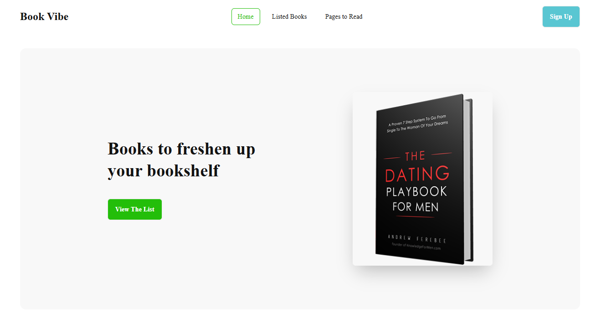
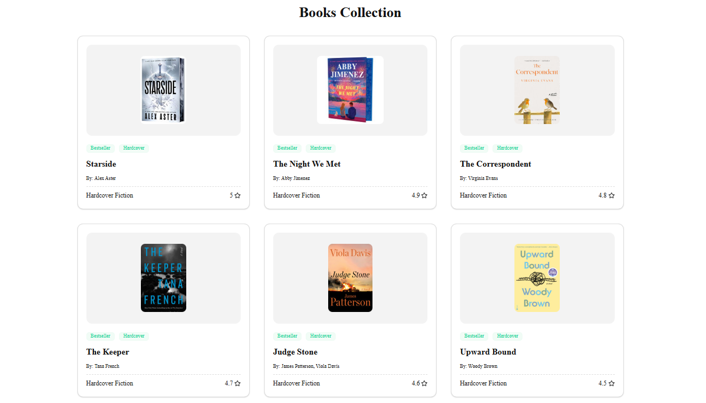
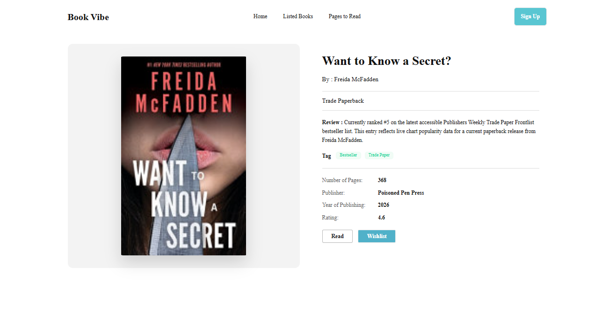
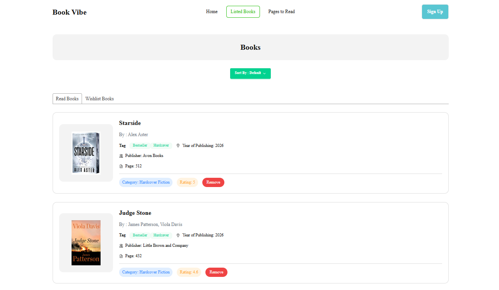
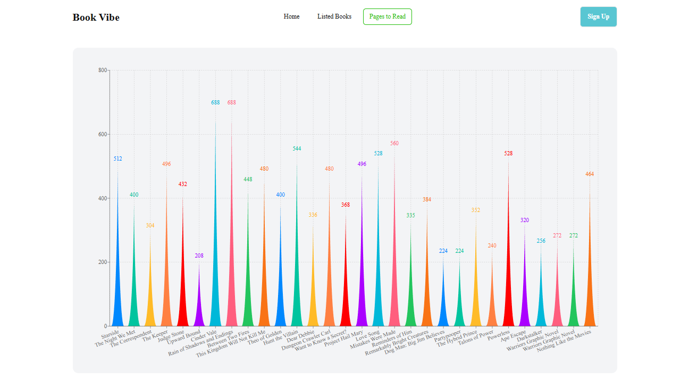

<div align="center">

# Book Vibe

### Discover, Save, and Organize Your Favorite Books

A polished book discovery and reading tracker built with React and Vite, where users can browse a curated books collection, inspect detailed book pages, add books to read or wishlist collections, sort saved entries, and visualize reading progress through a pages-to-read chart.

[](https://bookvibe2026.vercel.app/)
[](https://react.dev/)
[](https://vitejs.dev/)
[](https://tailwindcss.com/)
[](https://daisyui.com/)
[](https://bookvibe2026.vercel.app/)

</div>

---

## Preview

<p align="center">
  
</p>

<p align="center">
  
</p>

<p align="center">
  
</p>

<p align="center">
  
</p>

<p align="center">
  
</p>

> **Live Site:** [https://bookvibe2026.vercel.app/](https://bookvibe2026.vercel.app/)

---

## Features

| Feature | Description |
| :--- | :--- |
| Browse Books Collection | Explore a responsive collection of books loaded from a local JSON dataset |
| Detailed Book Pages | Open individual book detail pages with cover art, metadata, tags, ratings, and review text |
| Read List Tracking | Add books to a personal read list and manage them later |
| Wishlist Management | Save books to a wishlist while preventing duplicates across lists |
| Local Storage Persistence | Read list and wishlist data persist across page refreshes through local storage |
| Sorting Controls | Sort saved books by page count or rating for easier organization |
| Reading Progress Visualization | View selected reading data through a chart-driven pages-to-read experience |
| Responsive Navigation | Includes a mobile-friendly floating dropdown menu and adaptive layout behavior |
| Cover Image Fallbacks | Book covers use layered fallback logic so missing external images do not break the UI |
| Toast Feedback | Users receive instant success and error messages for add, remove, and validation actions |

---

## Tech Stack

<div align="center">

| Technology | Purpose |
| :---: | :---: |
| **React 19** | Component-driven UI and modern client rendering |
| **Vite 8** | Fast development server and production bundling |
| **Tailwind CSS 4** | Utility-first styling and responsive layout system |
| **DaisyUI 5** | Prebuilt UI primitives layered into the interface |
| **React Router 7** | Client-side routing for homepage, details, saved lists, and chart views |
| **React Toastify** | User feedback through toast notifications |
| **React Tabs** | Tabbed UI for read list and wishlist sections |
| **Recharts** | Reading-progress data visualization in the pages-to-read view |
| **Local JSON Data** | Book data served from `public/booksData.json` |
| **Vercel** | Deployment and hosting |

</div>

---

## Getting Started

### Prerequisites

- **Node.js** `v18+`
- **npm** `v9+`

### Installation

1. **Clone the repository**

   ```bash
   git clone <your-repository-url>
   cd book-vibe
   ```

2. **Install dependencies**

   ```bash
   npm install
   ```

3. **Start the development server**

   ```bash
   npm run dev
   ```

4. **Open in your browser**

   Navigate to `http://localhost:5173` to view the app locally.

---

## Project Structure

```text
book-vibe/
├── public/
│   ├── book-cover-placeholder.svg
│   ├── booksData.json
│   ├── favicon.svg
│   ├── icons.svg
│   ├── logo.png
│   ├── preview1.png
│   ├── preview2.png
│   ├── preview3.png
│   ├── preview4.png
│   └── preview5.png
├── src/
│   ├── assets/
│   │   ├── bannerImg.png
│   │   ├── BookDetails.png
│   │   ├── HomePage.png
│   │   ├── PageToRead.png
│   │   └── ReadList.png
│   ├── components/
│   │   ├── homepage/
│   │   │   ├── AllBooks.jsx
│   │   │   └── Banner.jsx
│   │   ├── listedBooks/
│   │   │   ├── ListedReadList.jsx
│   │   │   └── ListedWishList.jsx
│   │   ├── shared/
│   │   │   └── navbar/
│   │   │       └── Navbar.jsx
│   │   └── ui/
│   │       ├── BookCard.jsx
│   │       ├── BookCover.jsx
│   │       └── FloatingDropdown.jsx
│   ├── context/
│   │   └── BookContext.jsx
│   ├── data/
│   │   └── booksData.json
│   ├── layout/
│   │   └── MainLayout.jsx
│   ├── pages/
│   │   ├── BookDetails/
│   │   │   └── BookDetails.jsx
│   │   ├── books/
│   │   │   └── Books.jsx
│   │   ├── ErrorPage/
│   │   │   └── ErrorPage.jsx
│   │   ├── homepage/
│   │   │   └── Homepage.jsx
│   │   └── PagesToRead/
│   │       └── PagesToRead.jsx
│   ├── routes/
│   │   └── Routes.jsx
│   ├── utils/
│   │   └── localDB.js
│   ├── App.css
│   ├── App.jsx
│   ├── index.css
│   └── main.jsx
├── index.html
├── package.json
├── vite.config.js
└── README.md
```

---

## Design Highlights

- Clean editorial-inspired layout with strong typography and generous whitespace
- Hero banner that introduces the app with a prominent featured book presentation
- Card-based browsing experience for book discovery and saved lists
- Responsive navigation with a floating mobile dropdown that avoids clipping and overlap issues
- Book detail pages that give covers more visual emphasis and clearer metadata hierarchy
- Lightweight, user-friendly saved-list workflow powered by local storage persistence

---

## Data Source

This project uses a local book dataset stored in:

```text
public/booksData.json
```

Each book entry includes:

- Book ID
- Book name
- Author
- Cover image URL
- Review
- Total pages
- Rating
- Category
- Tags
- Publisher
- Year of publishing

---

## Deployment

The application is deployed on **Vercel**:

**Live URL:** [https://bookvibe2026.vercel.app/](https://bookvibe2026.vercel.app/)

---

<div align="center">

**If you found this project useful, consider giving it a star!**

Made with React, Vite, Tailwind CSS, DaisyUI, React Router, and Recharts

</div>
